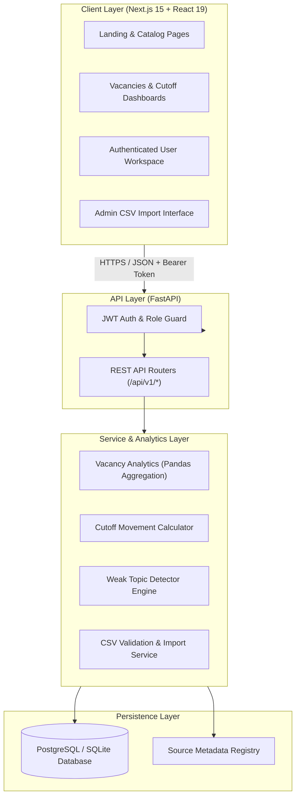
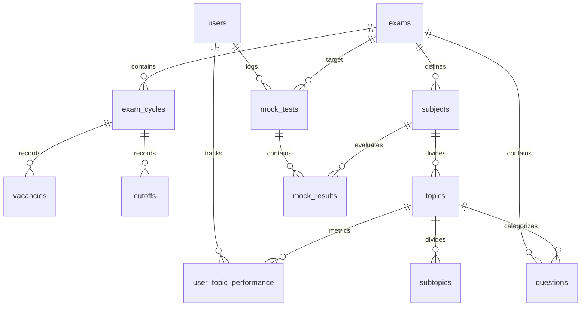

# Architecture & Technical Design Document

This document describes the high-level system architecture, database ER model, analytics pipelines, authentication lifecycle, and data import protocol for **ExamIntel India**.

---

## 1. System Architecture Diagram

---

## 2. Database Entity Relationship Model

---

## 3. Data Flow & Security Model

### Authentication & Authorization Flow
1. User submits credentials via `/api/v1/auth/login`.
2. Backend verifies password hash using standard `bcrypt` password check (`bcrypt.checkpw`).
3. Upon validation, a signed JWT access token (`HS256`) containing `user_id`, `email`, and `role` is returned.
4. Protected API endpoints validate the Bearer token via `get_current_user` and `get_current_admin` FastAPI dependencies.

### Admin CSV Data Import Pipeline
1. Admin uploads CSV via `/api/v1/admin/import` specifying `data_type` (`vacancies`, `cutoffs`, or `questions`).
2. `CSVImporter` checks missing header columns, invalid data types, non-existent foreign keys (`exam_slug`), and duplicate records.
3. Successfully validated rows are inserted transactionally into database tables.
4. Any row failing validation is collected and converted into a downloadable error CSV log file.

---

## 4. Analytical Formula Implementations

### Year-over-Year (YoY) Vacancy Percentage Change
$$\text{Percentage Change} = \frac{\text{Vacancies}_t - \text{Vacancies}_{t-1}}{\text{Vacancies}_{t-1}} \times 100$$

### 3-Year Cutoff Movement Calculation
$$\text{Movement Points} = \text{Cutoff}_{\text{latest}} - \text{Cutoff}_{\text{base (3 yrs prior)}}$$

### Mock Attempt Accuracy & Attempt Rate
$$\text{Accuracy (\%)} = \frac{\text{Total Correct}}{\text{Total Attempted}} \times 100$$

$$\text{Error Rate (\%)} = \frac{\text{Total Incorrect}}{\text{Total Attempted}} \times 100$$

### Transparent Weak Topic Identification Criteria
A topic is flagged as weak if:
- $\text{Accuracy} < 60.0\%$ (Target threshold)
- $\text{Average Time per Question} > 90.0 \text{ seconds}$
- $\text{Question Attempts} < 15$
